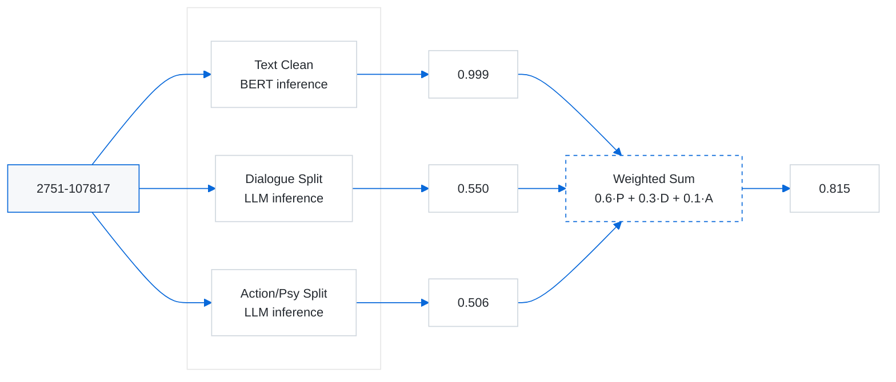

<a id="readme-top"></a>

<!-- PROJECT LOGO -->
<br />

<h3 align="center">BERT-LLM-Yuri-cls</h3>
  <div align="center">
    <a href="https://github.com/ArtistC220/BERT-LLM-Yuri-cls">
      
    </a>
  <p align="center">
    一个基于BERT微调与LLM进行文本分类与统计的百合作品轻重分类项目
    <!--
    <br />
    <a href="https://github.com/github_username/repo_name"><strong>Explore the docs »</strong></a>
    <br />
    <br />
    <a href="https://github.com/github_username/repo_name">View Demo</a>
    &middot;
    <a href="https://github.com/github_username/repo_name/issues/new?labels=bug&template=bug-report---.md">Report Bug</a>
    &middot;
    <a href="https://github.com/github_username/repo_name/issues/new?labels=enhancement&template=feature-request---.md">Request Feature</a>
    -->
  </p>
</div>
<!-- TABLE OF CONTENTS -->
<details>
  <summary>目录</summary>
  <ol>
    <li>
      <a href="#about-the-project">关于项目</a>
      <ul>
        <li><a href="#built-with">技术栈</a></li>
      </ul>
    </li>
    <li>
        <a href="#result">结果展示</a>
    </li>
    <li>
      <a href="#getting-started">如何开始</a>
      <ul>
        <li><a href="#prerequisites">需求</a></li>
        <li><a href="#installation">安装</a></li>
      </ul>
    </li>
    <li><a href="#abort-train">关于训练</a></li>
    <li><a href="#usage">用法</a></li>
    <li><a href="#roadmap">路线图</a></li>
    <li><a href="#contributing">Contributing</a></li>
    <li><a href="#license">License</a></li>
    <li><a href="#contact">联系方式</a></li>
    <li><a href="#acknowledgments">致谢</a></li>
  </ol>
</details>


<!--
  <p align="center">
  
  </p>
-->
<p align="center">
  
  </p>


## <a id="about-the-project"></a>关于项目

本项目旨在探索模糊数学理论与传统大模型微调（BERT）和大语言模型（LLM）相结合，在百合文学作品分类中的应用效果。  
项目的初期目标是通过模型训练构建隶属函数，针对性地给出百合文学作品在“重百合”集合中的隶属度，以此衡量百合作品的“轻重”程度。主要思路是利用BERT微调进行文本初步分类，同时结合大语言模型（LLM）进行辅助统计以参与结果计算，提供相对高效、准确的分类与理解。


以下是文本`2751-107817`的卷级推理为例的卷级推理简略工作流程展示。




目前，项目已完成以下工作：
- **数据采集与清洗**  
- **模型微调训练**  
- **推理与统计**  
- **结果计算**

项目中已经有两个训练好的模型，一个基于[chinese-roberta-wwm-ext](https://huggingface.co/hfl/chinese-roberta-wwm-ext)进行微调（下称轻量版），另一个基于[chinese-roberta-wwm-ext-large](https://huggingface.co/hfl/chinese-roberta-wwm-ext-large)进行微调（下称large版），在初步分类时对于未见文本auc在0.8左右，综合auc在0.95左右，large版的准确率略高于轻量版，在结果展示、历史排行中以基于large版推理的结果作为标准。

本项目提供了初步完整的脚本，涵盖了数据处理、推理、统计以及计算结果的整个流程，用户可以方便地进行使用和定制。


### <a id ="#built-with"></a>技术栈：
- **BERT**：微调用于结果分类。
- **LLM（kimi-k2-0905-preview）**：用于辅助分析统计。
- **Python**：项目主要开发语言，依赖 PyTorch/scikit-learn 等框架。

<p align="right">(<a href="#readme-top">回到顶部</a>)</p>

## <a id="#result"></a>结果展示

以下是项目计算书级隶属度倒序排序前 60 条结果（使用两个预训练模型中的large模型进行推理）：


<details>
  <summary>点击展开查看结果</summary>

  | 序号 | 标题 | 隶属度 |
  |------|------|--------|
  | 1    | 志乃与恋 Future | 0.996782 |
  | 2    | 将放言说不会输的高颜值女孩，全力征服的百合故事 | 0.928148 |
  | 3    | 猫之山宁宁子是猫族 | 0.848975 |
  | 4    | 心上人的妹妹(我心爱之人的妹妹) | 0.811364 |
  | 5    | 败给性格恶劣的天才儿时玩伴，初体验全部被她夺走 | 0.801504 |
  | 6    | 摩卡奇诺-小学生百合短篇集- | 0.799350 |
  | 7    | 人妻教师被班里的女高中生迷的神魂颠倒的故事 | 0.796929 |
  | 8    | 384403km 绑架你到月球 | 0.785372 |
  | 9    | Aster girl（紫菀少女） | 0.784490 |
  | 10   | 被百合夹击的女子有罪吗？(夹在百合中间的女人，有罪吗？) | 0.782509 |
  | 11   | 我买下了与她的每周密会～以五千圆为借口，共度两人时光 | 0.780667 |
  | 12   | 班上的公主是我的小狗 | 0.774236 |
  | 13   | 夏天的少女归来了 | 0.737712 |
  | 14   | 我们不可能成为恋人！绝对不行！ | 0.735510 |
  | 15   | 与她女友的不纯初恋 | 0.730650 |
  | 16   | 在放学后的教室里，恋爱浮现 | 0.729883 |
  | 17   | 我的初恋对象与人接吻了 | 0.727747 |
  | 18   | 碱性劣等生 | 0.710340 |
  | 19   | 终将成为你 关于佐伯沙弥香 | 0.709619 |
  | 20   | 她她 | 0.708749 |
  | 21   | CARNEADES | 0.704589 |
  | 22   | 少女妄想中 | 0.703445 |
  | 23   | 无法忘怀的魔女故事 | 0.703148 |
  | 24   | 惊爆草莓 | 0.703086 |
  | 25   | 菖蒲的少女革命！ | 0.701105 |
  | 26   | 捡到小猫，我也仅是小猫 | 0.700927 |
  | 27   | 心生研究社 | 0.698977 |
  | 28   | 我发现了小小的百合 | 0.698102 |
  | 29   | 截稿日之前，百合的进度特别快 | 0.697744 |
  | 30   | 野花——在那花不开的世界 | 0.696593 |
  | 31   | 最后的蓝(End Blue) | 0.696233 |
  | 32   | 你以为我的百合人设只是商业卖点？ | 0.689867 |
  | 33   | 鹿乃江同学的左手 | 0.686301 |
  | 34   | 幽灵列车与金平糖 | 0.685548 |
  | 35   | 将放言说女生之间不可能的女孩子 | 0.684732 |
  | 36   | 回忆重叠的乐园战场 | 0.684117 |
  | 37   | 焦点深度 | 0.679076 |
  | 38   | simoun 祈舞 | 0.673038 |
  | 39   | 区区平民竟敢这么嚣张！ | 0.671259 |
  | 40   | 野花通信 | 0.669396 |
  | 41   | 魔法少女小圆 | 0.666535 |
  | 42   | 魔女的宠爱 | 0.666151 |
  | 43   | 为了拯救世界的那一天 | 0.665381 |
  | 44   | 神明大人会把笑心○○○？ | 0.663692 |
  | 45   | 里世界远足 | 0.661139 |
  | 46   | 转生公主与天才千金的魔法革命 | 0.660420 |
  | 47   | 无法成为神明的少女 | 0.659998 |
  | 48   | 我的推是坏人大小姐 | 0.657056 |
  | 49   | 香草追击 A sweet partner | 0.656366 |
  | 50   | 在这得说猫语 | 0.655392 |
  | 51   | 人类的时代结束了，但肚子还是会饿吗？ | 0.653398 |
  | 52   | 红线 绊之记忆 | 0.650827 |
  | 53   | 紫色的Qualia | 0.650605 |
  | 54   | 双星·飓风·离乡人 | 0.650341 |
  | 55   | 凭你也想讨伐魔王？ | 0.649588 |
  | 56   | 魔女们的选择 | 0.647366 |
  | 57   | 安达与岛村 | 0.644039 |
  | 58   | 末日尽头的少女背包之旅 | 0.642044 |
  | 59   | 不动火轮一动不动 | 0.641523 |
  | 60   | IDOLISING偶像擂台！ | 0.638505 |

</details>


完整书级隶属度排序请查看 [book_weighted_with_title_sorted_large.csv](./csv/result02/大模型/book_weighted_with_title_sorted_large.csv)。
完整卷级隶属度排序请查看 [volume_weighted_with_title_sorted_large.csv](./csv/result02/大模型/volume_weighted_with_title_sorted_large.csv)。

更多详细数据可以在`csv\result02\大模型\`以及`csv\result02\小模型\`文件夹中找到。

<p align="right">(<a href="#readme-top">回到顶部</a>)</p>


<!-- GETTING STARTED -->
## <a id="getting-started"></a>如何开始

如果你希望在本地进行作品重百合隶属度推理，可以遵循以下步骤：

### <a id="#prerequisites"></a>需求

先确保依赖完整，你可以通过以下命令来安装依赖。

建议使用虚拟环境。
* bash
  ```sh
  python -m venv venv
  venv\Scripts\activate  
  pip install -r requirements.txt
  ```
如果想用全局环境，也可以直接。
* bash
  ```sh  
  pip install -r requirements.txt
  ```

请确保安装的是适合你的 CUDA 版本的 PyTorch。
笔者使用的显卡是RTX5060移动版，构建项目时的环境在[u-requirements.txt](./assets/u-requirements.txt)，仅供参考。

### <a id="#installation"></a>安装

1. **克隆仓库。**
   运行以下命令来克隆项目仓库：
* bash
   ```sh
   git clone https://github.com/ArtistC220/BERT-LLM-Yuri-cls.git
   ```
2. **下载一个预训练模型。**
   - 轻量版的压缩包已经上传到仓库的Releases中，你可以直接在仓库下载[BERT-Yuri-CLS](https://github.com/ArtistC220/BERT-LLM-Yuri-cls/releases/tag/v1.0.0)。
   
   - 也可以通过运行`script\download_model.bat`下载。

   - large版已经上传至[BERT-Yuri-CLS-Large](https://huggingface.co/yeyeye0118/BERT-Yuri-CLS-Large)。

3. **确保将模型放在正确的位置。**
   建议将含模型的文件夹放在`models/`目录下。
   将你下载的模型路径输入`config.json`的对应位置上。
   ```json
   "bert_checkpoint": "./models/checkpoint-47200", 
   ```

4. **获取一个LLM的api key。**
   本项目使用了 [kimi-k2-0905-preview](https://platform.moonshot.cn/docs/pricing/chat)，这是一种中文长文本处理能力优秀且幻觉较低的 LLM。你需要注册并获取 API 密钥。
   
5. **将你的api key输入 `config.json`的对应位置上。**
   ``` json
   "api_key": "your-api-key",
   ```

<p align="right">(<a href="#readme-top">back to top</a>)</p>

<!-- USAGE EXAMPLES -->
## <a id="usage"></a>用法

1. **准备文本文件**

   将你要推理的百合文学作品文本放入 `txt_test/` 文件夹。请确保文件格式为 `.txt`，且命名格式遵循 `书号_卷号` 的规则。例如，文件命名为 `1683_99285.txt`。项目中使用的编号源自 [轻小说文库](https://www.wenku8.net/)，如果该文本在其中收录，尽量使用对应的编号。

2. **运行推理程序**

   使用 `run_all.py` 来执行推理任务。  
   - **第一次运行**：直接运行 `run_all.py` ，执行`run`即可。
   - **后续运行**：先执行 `update` 再执行 `run`。`update` 操作会清理上一次推理时产生的缓存数据（如表格和临时文件）。你可以在 `script\update.py` 中查看具体清理目录和白名单信息。请在执行前保存好需要的临时数据。

3. **查看结果**

   推理完成后，结果会保存到以下文件夹：
   - `csv\weighted/`：生成的推理计算结果文件。
   - `csv\history_rank_book` 和 `csv\history_rank_volume`：这两个文件会生成带有时间戳的历史计算结果，并将其与排行榜数据合并。请注意，这项功能目前还比较粗糙，可能需要进一步优化。

   **重要提示：** 强烈建议单独保存 `csv\weighted/` 中的计算结果，因为该文件夹会作为缓存文件被清理。

4. **使用测试文本**

   在 `txt_test/` 文件夹中，已经提供了一份测试文本 `txt_test\100002_8.txt`，你可以使用它作为测试样例。

<p align="right">(<a href="#readme-top">回到顶部</a>)</p>

## <a id="about-train"></a>关于训练

- 关于训练的脚本目前还没有模块化，仍然在比较原始的状态，但所有的训练脚本以及训练时可能用到的工具都已经放到`script/`中。你可以通过查看[temppath.txt](temppath.txt)来查看部分已经标注的训练脚本路径，[tree.txt](tree.txt)可能会在变动训练脚本中的路径时有很大帮助。绝大多数的训练脚本在更改好所需文件的相对路径后都能直接运行。

- 关于训练数据，出于版权考虑不在项目中提供，你可以通过`spider/`中的脚本尝试获取训练数据，也可以联系我提供训练数据。


## <a id="roadmap"></a>路线图

出于时间，设备，经验等多方面限制，本项目在后续更新上可能会十分缓慢，我们非常希望有能者继续对本项目做出贡献！

路线图将列出本项目可能的后续发展方向，甚至本项目以外的发展目标，欢迎感兴趣的朋友们尝试。

- [ ] 完善排行榜数据合并脚本。
- [ ] 实现训练脚本的模块化搭建。
- [ ] 细化数据标记，进一步改善预训练模型的推理准确度。
- [ ] 更多种的预训练模型。
- [ ] 提高LLM的分析统计部分的准确性。
- [ ] 最后加权计算结果时使用动态更新的权重。
- [ ] 引入多模态实现百合漫画、百合动画的轻重分类。


## <a id="contributing"></a>Contributing

欢迎对本项目进行贡献！请遵循以下步骤：

1. Fork 本仓库
2. 创建一个功能分支 (`git checkout -b feature-branch`)
3. 提交更改 (`git commit -am 'Add new feature'`)
4. 推送到分支 (`git push origin feature-branch`)
5. 创建一个新的 Pull Request（PR）

如果你遇到问题，或者有功能建议，可以通过 Issues 提交给我们。我们非常欢迎你的反馈和改进意见！

更多贡献细节请查看 [CONTRIBUTING.md](CONTRIBUTING.md)。

<p align="right">(<a href="#readme-top">回到顶部</a>)</p>

## <a id="license"></a>License

本项目使用 [MIT License](LICENSE) 进行授权。

MIT License 是一个非常宽松的开源协议，允许任何人自由地使用、修改、分发本项目代码，但不承担任何责任。

<p align="right">(<a href="#readme-top">回到顶部</a>)</p>

## <a id="contact"></a>联系方式

如果你有任何问题、建议或合作意向，可以通过以下方式联系项目维护者：

- **GitHub Issues**  
  [新建 Issue](https://github.com/ArtistC220/BERT-LLM-Yuri-cls/issues/new) 

- **邮件**  
  请发送邮件至：  
  **ArtistC220@outlook.com**  
  邮件标题建议以 `[BERT-Yuri-CLS]` 开头，方便快速检索。

- **公众号**
  紧急信息可以通过公众号[MathArtistC](https://mp.weixin.qq.com/s/gGV4TMD1QEpxxvVVHRdjPg)联系。

- **GitHub 主页**  
  欢迎访问 [@ArtistC220](https://github.com/ArtistC220) 点 ⭐ 支持！


<p align="right">(<a href="#readme-top">回到顶部</a>)</p>

## <a id="acknowledgments"></a>致谢

- **合作伙伴**: 感谢 [yeyeye0118](https://github.com/yeyeye0118) 完成了large版的训练、LLM部分的脚本以及模块化脚本的构建。
      感谢[qmskidi](https://github.com/qmskidi)在训练文本标记时提供的帮助，以及在最后成果评估时的支持。
- **数据集提供者**: 感谢 [轻小说文库](https://www.wenku8.net/) 提供的文本数据集，支持本项目的研究和开发。

<p align="right">(<a href="#readme-top">回到顶部</a>)</p>

<p align="center">
  
  </p>
